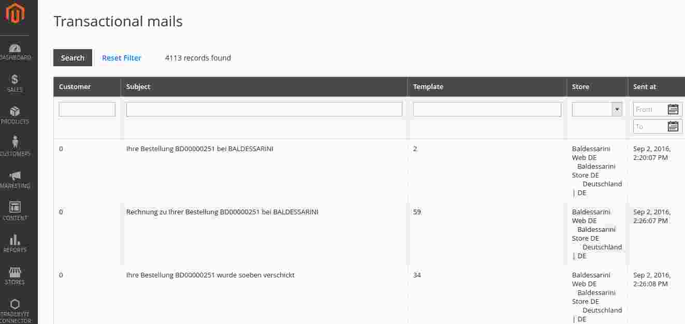

# Magento 2 enhanced mailing module

This module enhances the magento 2 capabilities to send transactional mails.
In a plain magento 2 installation it is neither possible to track and manage 
transactional emails sent by magento 2 system, nor it is possible to store 
mails locally or at backup service providers.

This mailing module distinguishes between parts of email processing:

- A mail transport system which takes care of transport of outgoing mails 
  to a mail service provider and retrieval of returning meta data for 
  mails entities.
  
- A mail storeage system which takes care of storing the data of outgoing
  mails and its metadata on file-systems.
  

As well the implemented transport system as the storeage system consist
of a configurable base class for Magento 2 and a second class for dynamic 
loaded plugin classes which performs the actual transport.
Therefore it is possible to keep the rich basic functionality of this mail 
module and to enhance it by vendor specific functionality.


## Installation

Add the module to your composer file.

```json
{
  "require": {    
    "shockwavemk/magento2-module-mail": "dev-master"
  }
}

```

Install the module with composer.

```bash

    composer update

```

On succeed, install the module via bin/magento console.

```bash

    bin/magento cache:clean
    
    bin/magento module:install Shockwavemk_Mail_Base
    
    bin/magento setup:upgrade

```


## Features

### Mail sending over configurable plugins

Transport and storeage configuration can be easily done via store config.
Installed plug-ins for transport and storeage can be selected at this point.


Supported vendors (so far):

Transport:

- Any SMTP server
- Mailgun

Storage:

- Local server storeage
- Dropbox


### Storeage of mail meta data in database


### Storeage of mail data as json files

Each mail sent by magento 2 is stored individual as json file.


Additional a rendered version of each mail is stored as .hmtl file.
This reduces loading times on review and enables external storeage
systems to preview content stored.

The default storeage stores all files sent by magento2 in a so called
"spool" folder. The mail data will stay at this local server path until 
it is deleted or moved.


With an installed storeage plugin a cronjob will automatically take care
to move all stored mails to your secure external storeage location.
Even if your server is reinstalled or you have to clean up your magento installation:
The conversation with you customers is safe.


### Enhanced admin customer management by transactional mail review

The customer administration is enhanced by an additional menu tab.

Select customer in main admin menu:


The marketing - user content - tab is enhanced by an additional menu point.
On this new section you can review and resend all (guest and customer) mails
sent by the magento2 system.





### Re-Sending of transactional mails. Re-Calculated or Re-Sending of stored mail data

This extension keeps track of each email sent from store.
For each of them it is possible to trigger an resending.


### Attachment handling and storeage of sent files

The base mail module supports attachment sending.
Magento2 does not support native file attachment handling, therefore you need to
add some code on your own.

In order to add files from filesystem, you need to change your email
sending strategy to "async".

You have to modify/override the EmailSenderHandler class.

```php

    /**
         * @param \Magento\Sales\Model\Order\Email\Sender                          $emailSender
         * @param \Magento\Sales\Model\ResourceModel\EntityAbstract                $entityResource
         * @param \Magento\Sales\Model\ResourceModel\Collection\AbstractCollection $entityCollection
         * @param \Magento\Framework\App\Config\ScopeConfigInterface               $globalConfig
         * @param Config                                                           $documentConfig
         * @param ObjectManagerInterface                                           $objectManager
         */
        public function __construct(
            \Magento\Sales\Model\Order\Email\Sender $emailSender,
            \Magento\Sales\Model\ResourceModel\EntityAbstract $entityResource,
            \Magento\Sales\Model\ResourceModel\Collection\AbstractCollection $entityCollection,
            \Magento\Framework\App\Config\ScopeConfigInterface $globalConfig,
            ObjectManagerInterface $objectManager
        )
        {
            parent::__construct($emailSender, $entityResource, $entityCollection, $globalConfig);

            $this->objectManager = $objectManager;
            $this->documentConfig = $documentConfig;

            // Dynamic typed build a collection for attachments for later usage

            // Should be extended from \Magento\Framework\Data\Collection
            $this->attachmentCollection = $this->objectManager->get(
                'Shockwavemk\Mail\Base\Model\Mail\AttachmentCollectionInterface'
            );
        }


    /**
     * Handles asynchronous email sending
     *
     * @return void
     * @throws \RuntimeException
     * @throws \Exception
     */
    public function sendEmails()
    {
        /** @var \Magento\Sales\Model\AbstractModel $item */
        foreach ($this->entityCollection->getItems() as $item) {

        // add this code

            // Create a new attachment

            if (!is_null($attachmentFilePath)) {
                /** @var \Shockwavemk\Mail\Base\Model\Mail\AttachmentInterface|\Magento\Framework\DataObject $attachment */
                $attachment = $this->objectManager
                    ->create('Shockwavemk\Mail\Base\Model\Mail\AttachmentInterface');

                // Do not transfer binary data to mail entity at this point: The mailer can handle file reading on its own
                $attachment->setFilePath($attachmentFilePath);

                // Add attachment to attachment collection
                // Let the mailer later decide how to handle them
                $this->attachmentCollection->addItem($attachment);
            }

        }

    }

```


